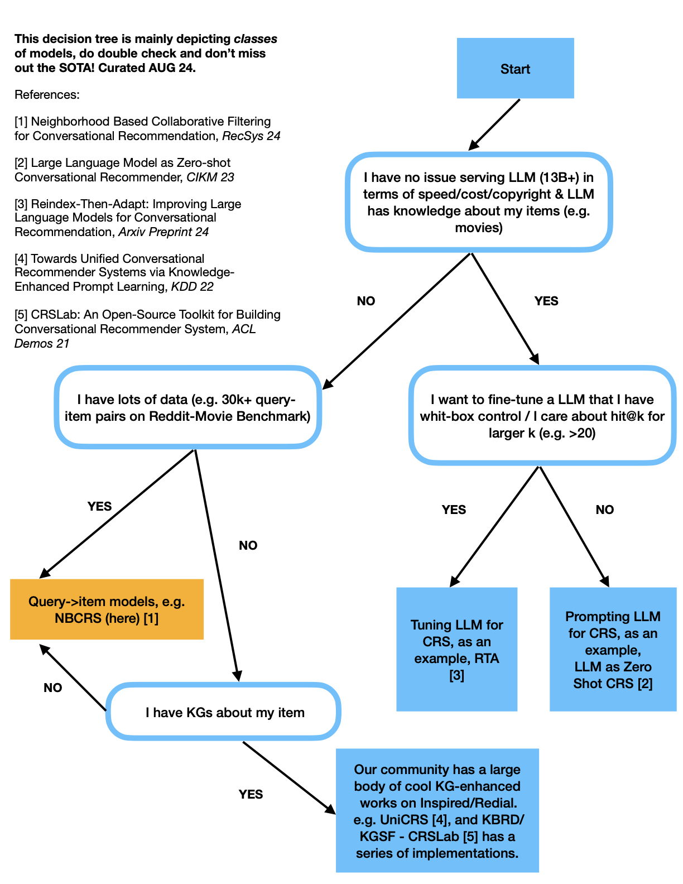

### NBCRS

Implementation for NBCRS: Neighborhood-based Collaborative Filtering for Conversational Recommendation (Recsys 24). 

The take away is KNN is a fairly strong baseline for CRS, too, esp when you don't have KGs or do have a large dataset!

### Should I use NBCRS?

Hopefully the figure below sheds some light on when to use which class of models - do double check your current SOTA so you don't miss things!



### datasets

Processed datasets (Inspired, Redial, Reddit) are in ```datasets``` folder.

### training

- Training code is in ```train_knnlm.py```, see ```modeling_nmf.py``` for the actual knnlm model.
- See ```train_knnlm.sh``` for bash commands for training the model.

### inference
- see ```inference_knnlm.ipynb``` for the code for tuning number of neighbors to use for the KNN component and doing inference on test set for the datasets.

### environment

- see ```requirements.txt``` which is exported via ```conda list -e > requirements.txt```.

### Procedure for running on a dataset:

- First, run ```generate_embeddings.py```, to generate semantic embeddings by factorizing item-item co-occur matrix. (mainly to stablize training)
- Then, run ```train_knnlm.py```. We use huggingface style training pipeline.
- Run ```inference_knnlm.ipynb``` to get evaluation results
   - Got way higher numbers for Inspired/Redial than in the paper? We found that the way we processed the data (including both movie and non-movie entities as target items during training while evaluating on predicting movies) results in lower numbers for the models compared to prior works.
   - Now, we exlucde non-movie entities during prediction by default. See usage of ```inspired/redial_eligible_entities``` variables for details in ```inference_knnlm.ipynb```; should be fairly easy to switch of this behavior by commenting out the post-filtering line.
   


